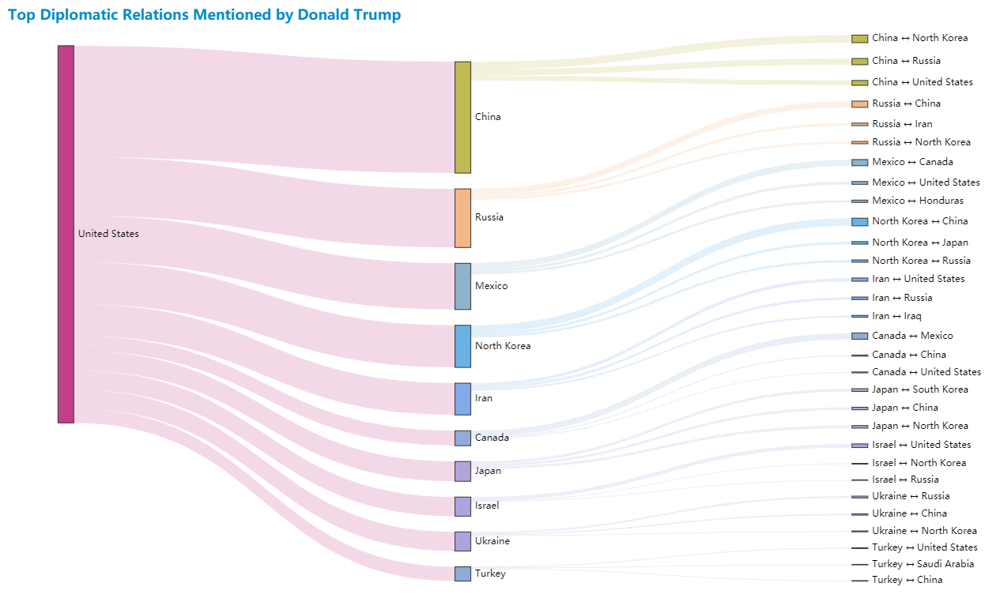

# Top Countries Mentioned by Donald Trump

[](https://www.python.org)
[](https://www.gnu.org/licenses/gpl-3.0.html)

## About The Project


This data visualization project shows the top countries and diplomatic relations mentioned by *Donald Trump* in his presidential term from 2017 to 2020. The related data are from his *Twitter*, speech transcripts and the *State of the Union Address*.

All processes are finished by *Python*. There is no third-party data platform involved.

## Getting Started

### Prerequisites

- Install [*Python 3.11*](https://www.python.org).

- Install all dependencies.

  ```bash
  pip install -r requirements.txt
  ```

### Running

```bash
python main.py
```

## Datasets

The project contains three `.csv` datasets, all coming from [*Kaggle*](https://www.kaggle.com). They are in the `data/origin` directory.

- [*Donald Trump*'s Tweets](https://www.kaggle.com/austinreese/trump-tweets)

  This contains *Donald Trump*'s tweets from 2009 to 2020.

- [Presidential Speeches](https://www.kaggle.com/littleotter/united-states-presidential-speeches)

  This contains all official presidential speeches of the *United States* from 1789 to 2019.

- [The *State of the Union Address*](https://www.kaggle.com/jyronw/us-state-of-the-union-addresses-1790-2019)

  This contains the *State of the Union Address* of the *United States* from 1790 to 2019.

## Visualization

The statistics are represented by three charts. All charts are in the `data/visualize` directory.

- **Stacked Bar Chart**

  

- **Flow Map**

  

- **Sankey Diagram**

  

## Documents

See `docs/wiki.md` for the details.

## Dependencies

- [*pandas*](https://pandas.pydata.org)
- [*Natural Language Toolkit*](https://www.nltk.org)
- [*spaCy*](https://spacy.io)
- [*pyecharts*](https://pyecharts.org)

## License

Distributed under the *GNU General Public License*. See `LICENSE` for more information.