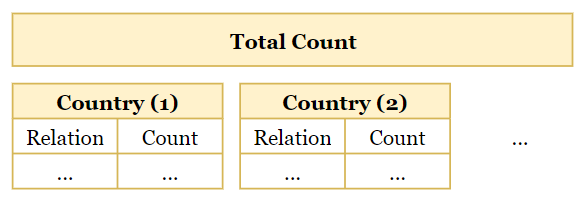

# Top Countries Mentioned by Donald Trump

[](https://www.python.org)


## About The Project


This data visualization project shows the top countries and diplomatic relations mentioned by *Donald Trump* in his presidential term from 2017 to 2020. The related data are from his *Twitter*, speech transcripts and the *State of the Union Address*.

All processes are finished by *Python*. There is no third-party data platform involved.

## Getting Started

### Prerequisites

- Install [*Python 3.11*](https://www.python.org).

- Install all dependencies.

  ```bash
  pip install -r requirements.txt
  ```

### Running

```bash
python main.py
```

## Data Collection

The project contains three `.csv` datasets, all coming from [*Kaggle*](https://www.kaggle.com). They are in the `data/origin` directory.

- [*Donald Trump*'s Tweets](https://www.kaggle.com/austinreese/trump-tweets)

  It contains *Donald Trump*'s tweets from 2009 to 2020.

- [Presidential Speeches](https://www.kaggle.com/littleotter/united-states-presidential-speeches)

  It contains all official presidential speeches of the *United States* from 1789 to 2019.

- [The *State of the Union Address*](https://www.kaggle.com/jyronw/us-state-of-the-union-addresses-1790-2019)

  It contains the *State of the Union Address* of the *United States* from 1790 to 2019.

  The *State of the Union Address* is an annual message delivered by the President of the *United States* to a joint session of the *United States Congress* at the beginning of each calendar year in office. The message typically includes a budget message and an economic report of the nation, and also allows the President to propose a legislative agenda and national priorities.

## Data Processing

In these datasets, we only need the content that belongs to *Donald Trump*'s first presidential term.

### Cleaning

The results of cleaning will be saved in the `data/clean` directory.

***Donald Trump*'s Tweets**

This dataset has the following columns:


Only the `date` and `content` columns are maintained by the project. And all tweets that are not posted between 2017 and 2020 should be deleted.


**Presidential Speeches** & **the *State of the Union Address***

These two datasets contain official presidential speeches of the *United States* from 1789 to 2019.


But we only need *Donald Trump*'s speeches.


### Integration & Segmentation

After cleaning, all datasets have the same form. They can be integrated and separated by year from 2017 to 2020. Each file contains all *Donald Trump*'s public statements in the corresponding year from three different datasets.


The results will be saved in the `data/segment` directory.

## Data Analyzing

Two statistics will be generated in this process and each statistic has two different counting forms: *total* and *annual* counts.

- The top countries mentioned by *Donald Trump*.

  

  

- The top diplomatic relations mentioned by *Donald Trump*.

  

  

### Sentence Segmentation

The analysis is based on the sentence, so at first I use [*NLTK*](https://www.nltk.org) to separate paragraphs into sentences.


### Noun Extraction

In order to count each country, all nouns in the sentence should be extracted.


After extracting, we can check every word to see if it is a country's name. It should be noticed that some countries have several synonyms, like *U.S.A.* and *America*, *U.K.* and *United Kingdom*.


### Counting Diplomatic Relations

This part is not so accurate because we cannot truly analyze the meaning of *Donald Trump*'s statements. So I use a simple way to get rough statistics.

If two or more countries are always mentioned closely at the same time, they might have diplomatic relations.


## Data Storage

All analysis results are saved as `.json` files in the `data/count` directory.


## Data Visualization

The statistics are represented by three charts using [*pyecharts*](https://pyecharts.org). All charts are in the `data/visualize` directory.

### Stacked Bar Chart


The [*pyecharts*](https://pyecharts.org) allows the user to select and combine the data from different years by clicking the legend.

### Flow Map


### Sankey Diagram


## Dependencies

- [*pandas*](https://pandas.pydata.org)
- [*Natural Language Toolkit*](https://www.nltk.org)
- [*spaCy*](https://spacy.io)
- [*pyecharts*](https://pyecharts.org)

## License

Distributed under the *MIT License*. See `LICENSE` for more information.